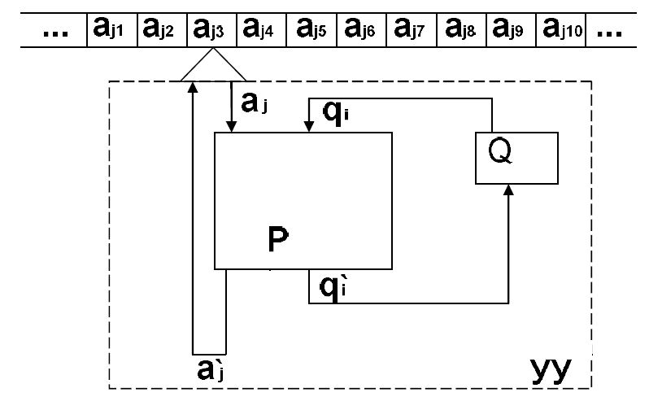

# Turing-machine  

## Основные сведения из теории

### Определение машины Тьюринга

Содержательно Машина Тьюринга (МТ) как абстрактный автомат, реализующий алгоритм вычисления некоторой вычислимой функции, состоит из трех компонентов:

1. Управляющее устройство (УУ), которое может находиться в одном из состояний, образующих конечное множество  — внутренний алфавит машины Тьюринга;
2. Бесконечная лента, разбитая на ячейки, в каждой из которых может быть записан один из символов конечного алфавита  — внешний алфавит машины Тьюринга;
3. Устройство обращения к ленте — считывающая и записывающая головка, которая в текущий момент времени считывает или записывает значение одной (текущей) ячейки ленты;

Scheme:  
  

### Принцип функционирования машины Тьюринга

Машина Тьюринга – абстрактный автомат задаваемый кортежем следующего вида:  
$$M = <Q, A, k_0 ,P>$$

* $Q$ – внутренний алфавит;  
* $A$ – внешний алфавит;  
* $k_0$ – начальная конфигурация;  
* $P$ – совокупность команд машины.

Среди символов внутреннего алфавита машины Тьюринга Q можно выделить:

* $q_0$ — начальное состояние МТ;
* $q_z$ — конечное состояние МТ  
  Машина начинает функционировать, находясь в состоянии $q_0 ∈ Q$;  
  и заканчивает (останавливается) в состоянии $q_z ∈ Q$.

Среди символов внешнего алфавита машины Тьюринга выделяют символ $λ$ – пустой
символ, $λ ∈ A$. Запись символа $λ$ в ячейку ленты означает очистку этой ячейки.  
Формальная команда машины Тьюринга может быть задана в следующем виде:  

$$\begin{equation} q_ia_j→q^`_ia^`_jd_k, \end{equation}$$  

где:

* $q_i$ и $q^`_i$ - состояние машины до и после выполнения команды;  
$q_i$ и $q^`_i ∈ Q$;  
* $a_j$ и $a^`_j$ - обозреваемый символ в ячейке до и после выполнения
команды;  
$a_j$ и $a^`_j ∈ A$;  
* $d_k$ – символ, указывающий направление сдвига головки;  
$d_k ∈ \{R, L, E\}$.  

Совокупность команд (программа) образует множество $P$.  
Полным состоянием или конфигурацией машины Тьюринга называется такая
совокупность символов из $A$ и $Q$, которая однозначно определяет дальнейшее поведение машины.  

Полное состояние (конфигурация) имеет следующий вид:  
>$k_j = a_1q_ia_2,$

где:

* $a_1$ — слово, находящееся на ленте слева от головки;  
* $q_i$ — текущее внутренне состояние; $q_i ∈ Q$;
* $a_2$ — слово, образованное символом, обозреваемым головкой и всеми символами
справа от него.  

Стандартной начальной конфигурацией называется конфигурация вида:
> $k_0=q_0a$,  

т.е. конфигурацию, при которой головка обозревает крайний левый символ записанного
на ленте слова $a$, а внутренними состоянием является $q_0 ∈ Q$.

Стандартной конечной конфигурацией называется конфигурация следующего вида:  
> $k_z=a_1q_za_2$,  

где $a_1$ и $a_2$ любые слова во внешнем алфавите $А$ (в т.ч. и пустые). Внутренним
состоянием является заключительное состояние $q_z ∈ Q$.

### Алгоритм работы Машины Тьюринга

В каждый дискретный момент времени (момент работы машины Тьюринга)

* Машина находится в одном из внутренних состояний;
* Головка обозревает одну из ячеек ленты.  

При переходе к следующему такту выполняются следующие действия:  

* Машина переходит в некоторое другое состояние (или остается в текущем
состоянии);
* В обозреваемую ячейку записывается некоторый символ (или содержимое ячейки
не изменяется);
* Головка передвигается на одну ячейку вправо $(R)$, влево $(L)$, или остается в том же
положении $(E)$.  

Шаг машины представляет собой считывание символа из обозреваемой ячейки, определение состояния, в котором находится управляющее устройство, и в зависимости от
этого, перевод управляющего устройства в новое состояние, запись на ленту нового
символа, и перемещение головки вправо $(R)$, влево $(L)$ или оставление головки на месте $(E)$.

## Постановка задачи  

* Создать программу на языке высокого уровня имитирующую работу машины Тьюринга;
* Написать программу для машины Тьюринга, реализующую вычисление арифметической функции: 2x – y.  

Должна быть составлена совокупность команд P.  Работа машины Тьюринга должна начинаться со стандартной начальной конфигурации и заканчиваться стандартной конечной конфигурацией.  

### Требования к программе

* Входная лента машины Тьюринга должна считываться из файла;
* Программа для машины Тьюринга должна считываться из файла;
* Алфавит должен считываться из файла;
* Результат работы программы должен выводиться в файл;
* Результат должен содержать следующие элементы:
  * Состояние ленты перед выполнением каждой команды;
  * Указание положения головки на ленте;
  * Выполненную команду;  
    | Пример         | |
    | -------------- |-|
    | 11*111 =       | — состояние ленты перед выполнением команды; |
    | ^              | — положение головки на ленте;                |
    | q0 1 -> q1 _ > | — выполняемая команда;                       |
    | _1*111 =       | — состояние ленты перед выполнением команды; |
    | &nbsp;^        | — положение головки на ленте;                |

* В программе должен быть реализован контроль возможных ошибок машины Тьюринга (не задан переход, отсутствует символ в алфавите и др.).

### Требования к входным данным

* Совокупность команд:  
  * Формат записи команд определяется согласно формуле (1) (см. выше);  
  * Каждая команда на отдельной строке.  
* Алфавит:  
  * Символы внешнего алфавита, перечислены в файле через пробел.  
